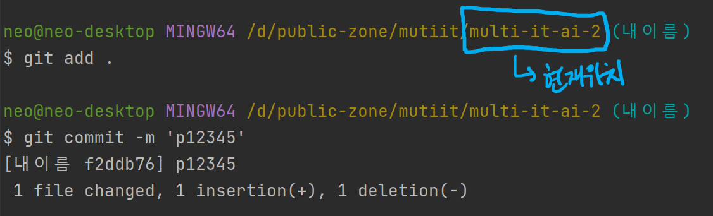
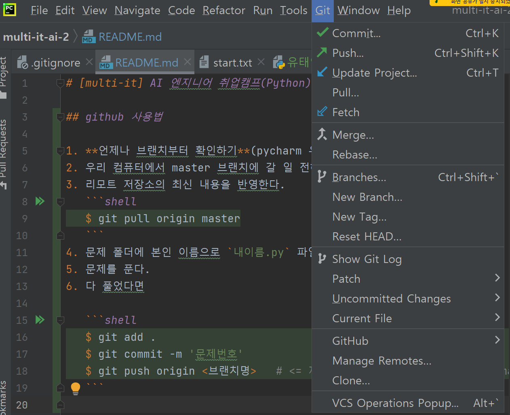
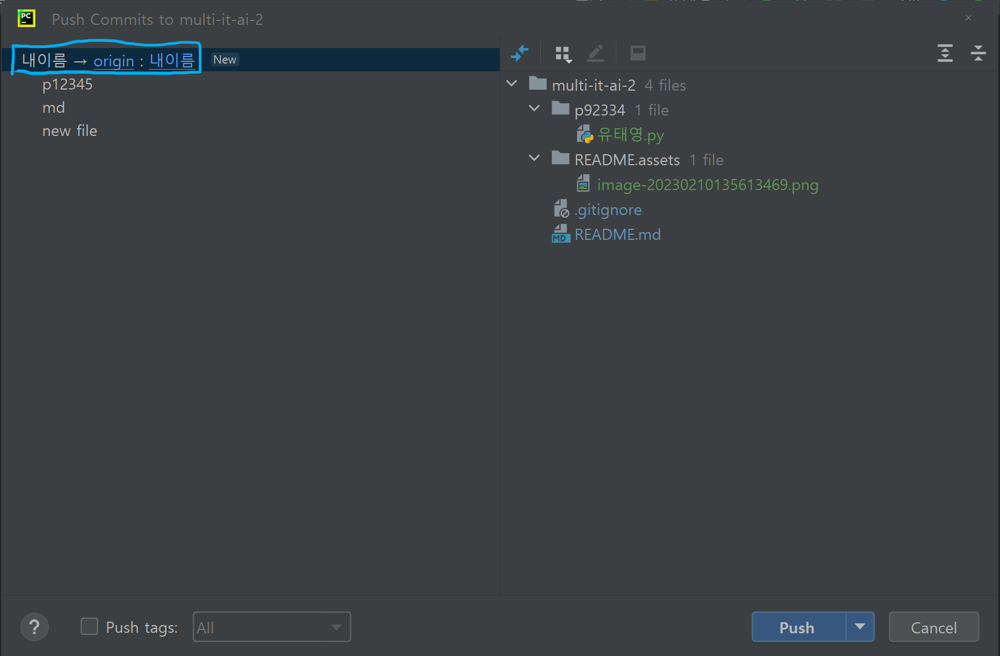
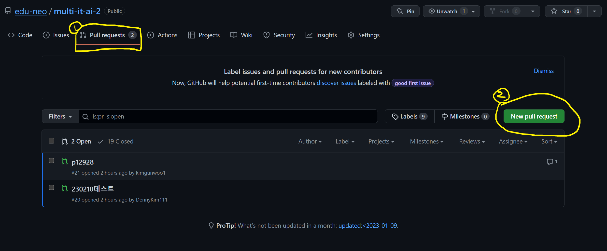
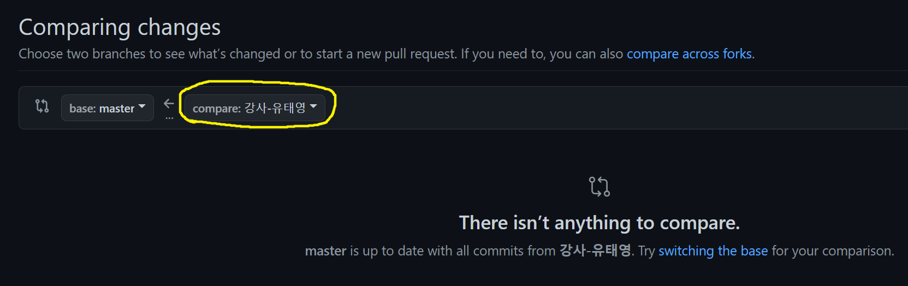

# [multi-it] AI 엔지니어 취업캠프(Python) 2

## github 사용법

1. **언제나 브랜치부터 확인하기**(pycharm 우측 하단에 브랜치명)

2. 우리 컴퓨터에서 master 브랜치에 갈 일 전혀 없음!!

3. 리모트 저장소의 최신 내용을 반영한다.
   ```shell
   $ git pull origin master
   ```
   
4. 문제 폴더에 본인 이름으로 `내이름.py` 파일을 만든다.

5. 문제를 푼다.

6. 다 풀었다면 커밋

   ```sh
   # add 전에 내 위치(pwd) 확인
   $ git add .
   $ git commit -m '문제번호'
   ```

   

7. 이후 PUSH

   ```sh
   $ git push origin <내이름>  # <= 절대 git push origin master 하지 않을 것
   ```

   

   

8. PR 생성 이후 Merge (만약 아무것도 할 게 없다고 나온다면, 실제로 반영할 게 없다는 뜻)

   

   

9. Merge Conflict 가 날 경우 본인 이름의 파일 말고 다른 파일을 만져서 문제인 상황. 강사에게 문의하세요